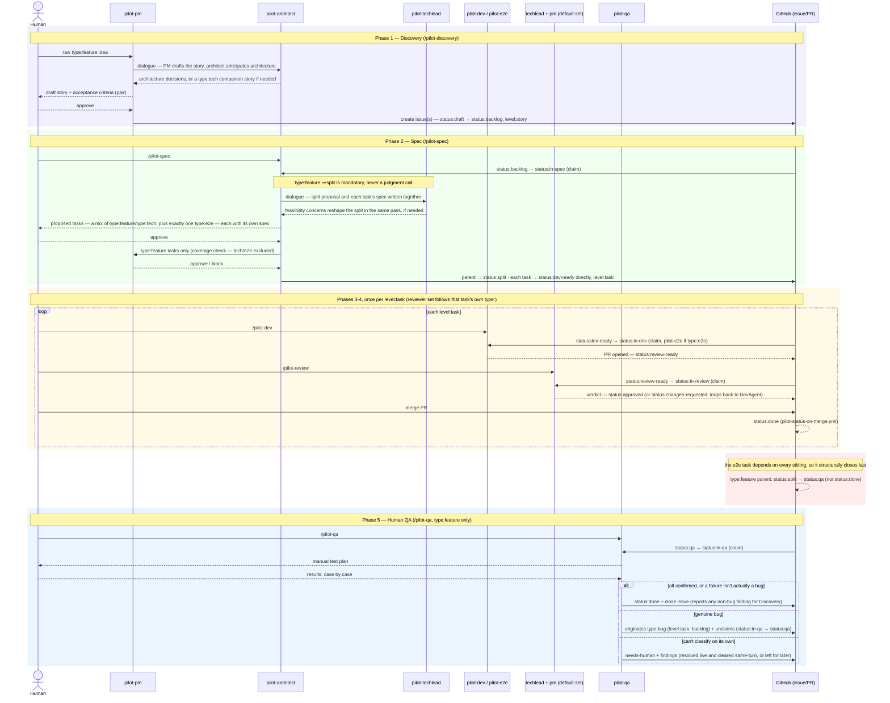

# PILOT — Visual Reference

This is a companion to `.pilot/pilot-process.md`, not a replacement for it. It exists purely
to help a **human** get oriented — nothing here is read by any phase skill or agent, and
nothing here is authoritative: if this file and `.pilot/pilot-process.md` ever disagree,
`.pilot/pilot-process.md` is right. It's PILOT-owned and kept in sync by `/pilot-update`, the
same as `.pilot/pilot-process.md` itself — never hand-edit it in a project that copied PILOT.

## Command quickstart

Every command below is a plain example — the exact syntax and behavior for each is
authoritative in that skill's own `SKILL.md` (`argument-hint`), not here:

```
/pilot-discovery "let a user filter search results by wheelchair accessibility"
    → PM+architect dialogue opens a type:feature issue (and, if the same effort needs
      one, a type:tech companion story alongside it)

/pilot-discovery --resume 12    → picks back up a status:draft ticket left mid-pair

/pilot-spec               → sweeps the next fresh/resumable status:backlog ticket, no
                            argument needed
/pilot-spec 42            → splits (if needed) and specs existing issue #42, pair by
                            default
/pilot-spec 42 --auto     → same, no live checkpoint (needed for a scheduled Routine)
/pilot-spec 42 --resume   → picks back up a mid-pair session, or a cleared needs-human
                            flag, on #42
/pilot-spec 12            → also re-scopes a type:feature story already at
                            status:qa/status:in-qa, for a new split round
/pilot-spec 42 --multi 3  → 3 architect+techlead dialogues on #42, in conversation with
                            each other, converging on one proposal (or needs-human on
                            genuine, irreconcilable disagreement)
/pilot-spec --tech "add the GitHub Actions CI workflow described in our tech-debt backlog"
    → originates a standalone type:tech story from scratch (no /pilot-discovery pass),
      then splits/specs it in the same run
/pilot-spec --bug "clicking export on the reports page throws a 500"
    → the one shared mechanism for creating a type:bug ticket — classifies it, creates
      it, and specs it in the same run

/pilot-dev               → claims and implements the next status:dev-ready ticket, no
                           argument needed
/pilot-dev 42            → claims and implements #42 specifically, pair by default
/pilot-dev 42 --auto     → same, no live checkpoint (needed for a scheduled Routine)
/pilot-dev 42 --resume   → picks back up a mid-pair session, or recovers a crashed
                           run's orphaned claim, on #42
/pilot-dev 42 --multi 3 → 3 devs discuss an approach for #42 with each other, converging
                           on one agreed plan a single dev then implements as one PR
                           (or needs-human, quoting the differing positions)

/pilot-review            → sweeps every status:review-ready/resumable PR, no argument
                           needed, pair by default
/pilot-review 57         → claims and runs phase 4 against PR/issue #57, pair by default
                          (must be status:review-ready, or status:in-review resumable)
/pilot-review 57 --auto  → same, no live checkpoint (needed for a scheduled Routine)
/pilot-review 57 --merge → merges the PR itself once every reviewer approves
/pilot-review 57 --resume → recovers a claim orphaned by a crashed phase-4 run
/pilot-review 57 --multi 3 → 3 instances of each default-set reviewer role independently
                           review #57 (no dialogue — reviewers stay isolated), each role
                           reconciled into one verdict
/pilot-review 57 --agents architect → adds the architect to this round's review
                           (never in either default set) alongside whichever roles the
                           ticket's own type already selects

/pilot-qa                → sweeps the next fresh status:qa or resumable status:in-qa
                           ticket, no argument needed
/pilot-qa 61             → runs phase 5 (human QA) against story #61 (must be status:qa)
/pilot-qa --resume 61    → picks back up a mid-pair session on #61

/pilot-auto             → sweep mode: tries review→dev→spec, in that fixed order,
                          against their own pools, stopping at the first with work to do
/pilot-auto --merge     → same, merging review's PR itself if that's the phase that runs
                          and its verdict is all-approve
/pilot-auto dev spec    → same, restricted to that subset (still tried in fixed order)
/pilot-auto 48          → tries the same three phases against ticket #48 specifically,
                          stopping at whichever one currently claims it
/pilot-auto 59          → same, and if #59 is a level:epic, each phase searches its
                          whole sub-issue tree for its own next actionable candidate
                          — drives whatever's really available anywhere under it, not
                          just under its top story
/pilot-auto 48 --merge  → same, and merges #48's PR itself once review's verdict is
                          all-approve
/pilot-auto 48 --multi 3 → same, forwarding --multi 3 to whichever phase claims #48
/pilot-auto --again     → sweep mode, but keeps going after each candidate instead of
                          stopping at the first — drains every pool in one call
/pilot-auto --next      → sweep mode for the first pass only; whichever candidate a
                          phase claims there, keep re-dispatching that one ticket
                          through the full chain instead of moving to another
/pilot-auto 48 --next   → keeps re-dispatching #48 after each phase advance, until
                          nothing's left to do, needs-human is flagged, it closes, or a
                          concurrent claim makes it look orphaned
                          (`--continue` is an accepted alias for `--next`)

/pilot-help             → lists every installed command, grouped and summarized
/pilot-help dev         → explains /pilot-dev in full (modes, flags, examples)
/pilot-help --multi     → explains --multi: which commands accept it, what it does
/pilot-help architect   → explains the pilot-architect persona (identity, which phases
                          use it) — no collision, so the bare name is enough
/pilot-help agent dev   → explains the pilot-dev persona specifically; bare "dev" would
                          instead explain the /pilot-dev command
/pilot-help "I want to keep retrying the same ticket until it's done"
                        → answers with the exact command (here, /pilot-auto <ticket>
                          --next), not just a description
/pilot-help "who checks security implications"
                        → names the persona (pilot-architect), not a command line —
                          the ask was "who", not "what do I run"
```

## Abandoning stuck work instead of resuming it

`--resume <issue>` and the `can-resume` label (`.pilot/pilot-process.md` §3) both continue
a ticket in place, recorded progress and all — `--resume` when you want to pick it back up
yourself right now, `can-resume` when you'd rather leave it for the next bare/scheduled
sweep to pick up unattended. If that recorded progress isn't worth continuing at all, you
can instead discard it yourself: manually revert the ticket's `status:` label back to
that phase's own pre-claim value (`status:backlog` for Spec, `status:dev-ready` isn't
reverted this way for Dev — hand-revert to `status:dev-ready` itself if you want it
re-attempted from scratch) and clear its assignee — the same labels a brand-new ticket
carries. This is purely something you do by hand on GitHub; no skill or agent needs to
know about it. Once reverted, the ticket looks exactly like fresh work and the next run
of that phase — bare, scheduled, or given the number directly — picks it up and starts
over from the ticket's original body.

## Example: a `type:feature` story end to end

The golden path below is deliberately the richest one PILOT has — it's the only path that
touches all five phases, a mandatory split with mixed task types, and every `status:`
transition that isn't itself a branch (`wont-do`, `changes-requested`, `needs-human`,
`on-hold`, a prerequisite ticket, `--resume`/reclaim, or re-scoping a story whose split is
already done) — those are covered in `.pilot/pilot-process.md` instead.


